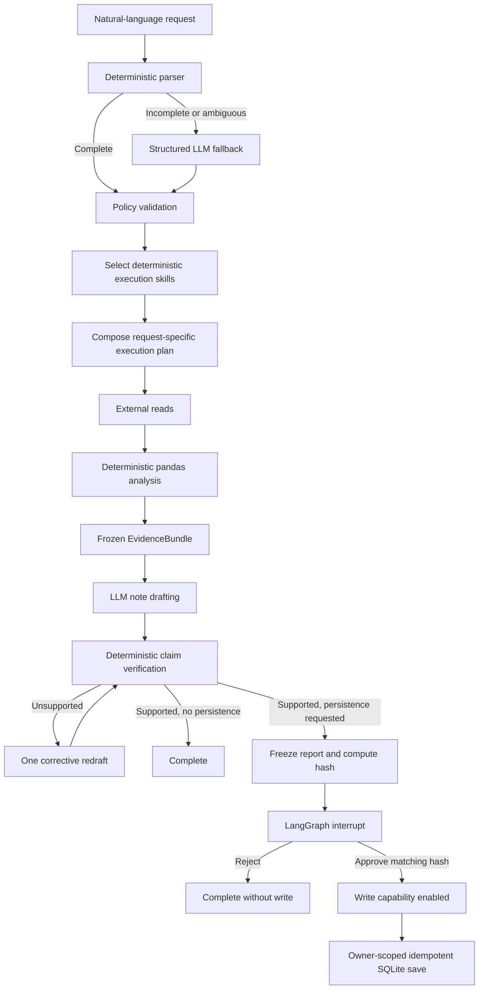

# Land Registry Agent

A time-boxed AI Engineer take-home demonstrating a deterministic, human-approved property-research workflow built with LangGraph.

The application interprets a natural-language request, creates a visible execution plan before external reads, retrieves HM Land Registry data, calculates evidence locally, drafts and verifies a grounded research note, and pauses before saving the exact approved report.

This is a focused demonstration project, not a production platform.

## Example request

> Analyse property price trends in GU1 over the last 3 years. Compare with the South East regional average. Identify the highest-value streets. Then prepare a one-paragraph research note and add it to my tracking sheet.

Reasonable variations are supported, including:

- another postcode or postcode district;
- another time window;
- optional regional comparison;
- optional street ranking;
- analysis without a research note;
- analysis without persistence;
- explicit instructions not to write anything;
- concise, detailed or explicitly bounded one-to-five-paragraph notes;
- requests for the latest available source data.

## What the project demonstrates

- Hybrid deterministic and LLM-assisted intent interpretation.
- Deterministic execution-skill selection from validated intent.
- A typed, request-specific plan created before external data access.
- LangGraph `StateGraph` orchestration with SQLite checkpoints.
- Flat Price Paid retrieval followed by local pandas aggregation.
- Regional House Price Index retrieval using the corrected endpoint.
- Sparse-data and non-overlapping-period policies.
- Frozen evidence and canonical SHA-256 hashes.
- Bounded research-note drafting through the OpenAI Python SDK.
- Deterministic verification of numerical and date claims.
- Durable human approval before write access is available.
- Hash validation and idempotent SQLite persistence.
- Application-level owner-scoped report queries.
- Chart-ready JSON rendered by Streamlit.
- Human-readable auditing without hidden chain-of-thought.

## Architecture

The LLM is used only where language interpretation or prose generation is useful. Python owns workflow selection, calculations, evidence sufficiency, verification, approval and persistence.



### Deterministic path

Supported requests follow a bounded workflow:

1. Interpret and validate the request.
2. Select bounded execution skills from the validated intent.
3. Compose and checkpoint the execution plan.
4. Stop so the UI can display the plan before external reads.
5. Retrieve only the required data sources.
6. Calculate metrics and evidence in Python.
7. Draft from the frozen evidence bundle.
8. Verify claims deterministically.
9. Pause before persistence.
10. Save only after matching explicit approval.

Optional operations are omitted from the plan. For example, a request without regional comparison does not retrieve HPI data.

### Deterministic execution skills

After policy validation, ordinary Python selects from five bounded skills:

- `local_property_trends`;
- `regional_comparison`;
- `street_value_ranking`;
- `research_note`;
- `approved_persistence`.

Each skill contributes ordered operation templates to the typed execution plan. Composition rejects duplicate skill names, duplicate operations and conflicting order values. The selected skill names are visible in the Streamlit UI and recorded in `ExecutionPlan` and the audit trace.

Skills control the permitted execution pattern; they do not invoke tools, grant write access or give the LLM new capabilities. Registered operations still run deterministically through the orchestrator, and persistence remains unavailable until explicit approval.

### LLM boundaries

Two logical language services are defined:

- `OpenAIIntentService` completes ambiguous structured intent.
- `OpenAINoteDraftingService` drafts bounded prose from frozen evidence according to the typed note-detail and paragraph-count request.

The note defaults to a detailed two-to-four-paragraph summary. A concise request produces one paragraph, while an explicit request for one to five paragraphs is honoured. The deterministic verifier applies to every resulting paragraph.

They can use different models through:

- `OPENAI_INTENT_MODEL`;
- `OPENAI_DRAFT_MODEL`.

The LLM does not:

- calculate means, medians or percentage changes;
- rank streets from raw rows;
- decide whether evidence is sufficient;
- receive unrestricted tools;
- approve a report;
- perform a write;
- modify an approved report payload.

### Tool registry and write gate

The orchestrator registers capabilities under four categories:

- read;
- analysis;
- language;
- write.

The normal workflow selects registered capabilities deterministically from the typed plan. A write capability raises an error unless the orchestrator explicitly invokes it with approval granted.

The registry is not exposed to the LLM.

## Human approval and exact writes

When persistence is requested:

1. The complete `ReportPayload` is constructed.
2. The evidence hash is validated.
3. A report hash is computed from canonical JSON.
4. The note, charts, limitations, destination, owner and report name are displayed.
5. LangGraph pauses using a durable interrupt.
6. The user approves or rejects the exact hash.
7. The resumed node validates the run ID, owner and report hash.
8. The repository independently validates the approval again.
9. The exact payload is saved idempotently.

The approval node has no side effects. The database write occurs in the following node because an interrupted LangGraph node restarts from its beginning when resumed.

## Data-source handling

### Price Paid SPARQL endpoint

The gateway accounts for the exercise’s documented endpoint behaviour:

- requests flat transaction rows rather than remote aggregation;
- uses the `common:` namespace for postcode and street fields;
- aggregates locally with pandas;
- normalises property-type URI suffixes;
- applies explicit HTTP timeouts;
- retries HTTP 429 and 5xx responses with bounded backoff;
- walks bounded `LIMIT`/`OFFSET` pages;
- deduplicates transactions by transaction ID;
- caches successful JSON responses locally;
- raises explicit errors when the pagination safety limit is reached.

This avoids expensive `GROUP BY`, `ORDER BY` and `AVG` SPARQL queries that can cause HTTP 503 responses.

### House Price Index endpoint

The gateway uses:

```text
https://landregistry.data.gov.uk/data/hpi/region/{region-name}.json
```

It does not use the obsolete `/api/1/slice/linked-hpi.json` path.

HPI data can be historically stale. The application therefore:

- retrieves the newest available source records;
- reports the actual source window;
- flags data more than one year old;
- does not assume that “latest” means the present day;
- prohibits like-for-like claims when local and regional periods do not overlap.

## Analytical policy

All numerical analysis is deterministic.

The evidence includes:

- monthly transaction count;
- monthly median sale price;
- monthly mean sale price;
- local start and end values;
- local percentage change when permitted;
- regional HPI start and end values;
- regional percentage change when permitted;
- local-versus-regional difference when periods overlap;
- streets ranked by median price;
- street sample sizes;
- source windows;
- confidence;
- limitations;
- chart-ready data;
- source URLs and cache artifact keys.

### Sparse-data rules

- Fewer than 10 local transactions produces low confidence.
- Local percentage-change claims are suppressed when evidence is insufficient.
- Street rankings are suppressed when local evidence is insufficient.
- A street requires at least 3 transactions to qualify.
- Unsupported conclusions are not passed to the drafting model.

These thresholds can be configured through environment variables.

## Verification

`EvidenceBundle` is immutable and serialised to canonical JSON before hashing.

The note verifier extracts:

- date claims;
- numeric and currency claims;
- percentage claims;
- local-versus-regional performance language;
- highest-value street claims.

Claims must be present in the evidence-derived allowlist. Unsupported claims trigger at most one corrective redraft. If the correction still fails, the workflow fails closed.

This is a deliberately bounded verifier rather than a general semantic-entailment system.

## Ownership and persistence

Approved reports are saved in a separate SQLite database from LangGraph checkpoints.

Every saved report has:

- a unique `rpt_...` report ID;
- an owner ID and display name;
- a run ID;
- a human-readable report name;
- the exact note and charts;
- canonical evidence;
- an evidence hash;
- a report hash;
- an ordered audit trace;
- approval and creation timestamps.

Repository reads include `owner_id` in the SQL query:

```sql
SELECT *
FROM approved_reports
WHERE report_id = ? AND owner_id = ?;
```

```sql
SELECT *
FROM approved_reports
WHERE owner_id = ?
ORDER BY approved_at DESC;
```

The Streamlit identity selector demonstrates application-level record ownership. It is not authentication. In production, `owner_id` would come from a validated identity token.

## Audit trace

Audit events contain:

- a contiguous sequence number;
- a timezone-aware timestamp;
- an action;
- a status;
- a user-readable explanation;
- safe metadata.

The audit trace records decisions and outcomes, not hidden reasoning or chain-of-thought. Credentials and unnecessary raw API responses are not stored.

## Project structure

```text
.
├── README.md
├── pyproject.toml
├── .env.example
├── .gitignore
├── main.py
├── data_sources.py
├── problem_statement.md
├── src/
│   └── land_registry_agent/
│       ├── __init__.py
│       ├── analysis.py
│       ├── config.py
│       ├── data.py
│       ├── intent.py
│       ├── llm.py
│       ├── models.py
│       ├── orchestrator.py
│       ├── repository.py
│       └── skills.py
└── tests/
    ├── test_analysis.py
    ├── test_intent.py
    ├── test_live_connections.py
    ├── test_llm.py
    ├── test_orchestrator.py
    ├── test_planning.py
    ├── test_repository.py
    └── test_verification.py
```

The structure is intentionally compact. Graph state and the capability registry stay with orchestration. Skill composition has its own small module so the mapping from validated intent to permitted execution pattern is explicit and independently testable.

## How to run

Python 3.11 or later is required.

From the project root, create a virtual environment and install the application with its development dependencies:

```bash
python3 -m venv .venv
source .venv/bin/activate
python -m pip install --upgrade pip
python -m pip install -e ".[dev]"
```

Copy the example configuration and add an OpenAI API key:

```bash
cp .env.example .env
```

Add an OpenAI API key to `.env` and adjust model names if necessary:

```dotenv
OPENAI_API_KEY=your-key-here
OPENAI_INTENT_MODEL=gpt-4o-mini
OPENAI_DRAFT_MODEL=gpt-4o-mini
```

The supplied key may not have access to every model. Model names are configuration, not hardcoded assumptions.

Start the Streamlit demonstration:

```bash
streamlit run main.py
```

Open the URL printed by Streamlit, normally `http://localhost:8501`. Stop the application with <kbd>Ctrl</kbd>+<kbd>C</kbd>.

For subsequent runs, activate the existing environment and start Streamlit:

```bash
source .venv/bin/activate
streamlit run main.py
```

## Model-access diagnostic

Check access to the configured intent and drafting models without running a full workflow:

```bash
python -m land_registry_agent.llm
```

This diagnostic is optional and is not called for every request.

The UI separates planning from execution:

1. Enter the demonstration owner and request.
2. Optionally enter a report name.
3. Select **Create execution plan**.
4. Review whether interpretation was deterministic or LLM-assisted, the typed intent, selected skills and plan before any external read.
5. Select **Execute plan**.
6. Review evidence, charts, limitations and the verified note.
7. Approve or reject the exact frozen report.
8. Open saved reports for the current owner.

Without `OPENAI_API_KEY`, existing saved reports remain viewable, but new end-to-end research runs are disabled.

## Tests and quality checks

The default tests use dependency injection, temporary SQLite databases, fake gateways and drafting stubs. They do not require live model or network calls.

Run the tests:

```bash
pytest
```

Run linting:

```bash
ruff check .
```

Run type checking:

```bash
mypy src tests
```

Run the opt-in live checks against Price Paid, regional HPI and the configured OpenAI models:

```bash
RUN_LIVE_TESTS=1 pytest tests/test_live_connections.py -v
```

The live checks load `.env`, make real network requests, can take over a minute and may consume a small amount of OpenAI API quota. They are skipped during the default test run.

The suite covers:

- deterministic parsing;
- structured fallback interpretation;
- note-detail and paragraph-count interpretation;
- bounded draft instructions and paragraph preservation;
- deterministic skill selection and composition conflicts;
- request-specific plan omission;
- capability write gating;
- plan creation before external reads;
- monthly metrics;
- sparse-data suppression;
- street sample thresholds;
- non-overlapping source periods;
- chart schemas;
- canonical evidence hashing;
- deterministic claim verification;
- approval pause before write;
- rejection and stale-hash paths;
- one corrective redraft;
- successful approved writes;
- idempotency;
- unique report IDs;
- owner-scoped listing and retrieval;
- audit ordering.

Live endpoint smoke tests are intentionally excluded from the default suite.

## Extension point for MCP

The normal request path is intentionally deterministic.

Future MCP support can be added behind the existing boundaries:

- register an MCP-backed capability in `ToolRegistry`;
- implement `PropertyDataGateway` through an MCP tool or resource adapter;
- store resource URIs as evidence provenance;
- map resource updates to artifact-cache invalidation;
- re-fetch only affected evidence;
- invalidate any report derived from changed evidence;
- resume or restart an explicitly controlled plan and require a new approval hash before persistence.

An actual `subscribe_resource` listener and autonomous dynamic tool loop are not implemented in this take-home. The resource URI, invalidation and controlled re-fetch seams are documented without claiming production-scale MCP infrastructure.

## Time-boxed trade-offs

Implemented:

- typed contracts;
- deterministic planning and analytics;
- deterministic execution-skill composition;
- bounded LLM responsibilities;
- configurable concise, detailed and explicitly sized research notes;
- real Land Registry gateway behavior;
- SQLite checkpointing and persistence;
- human approval;
- exact-write hashing;
- ownership;
- auditing;
- chart-ready output;
- minimal Streamlit UI;
- network-free tests.

Deliberately deferred:

- secure authentication;
- enterprise RBAC;
- distributed databases;
- concurrent multi-worker deployment;
- production cache coordination;
- complete MCP resource subscriptions;
- cloud deployment;
- background workers;
- polished frontend design;
- sophisticated statistical modelling;
- production observability.

SQLite connections and Streamlit resource caching are appropriate for a single-process demonstration. A production deployment would require a different checkpoint and persistence strategy.

## Reviewer walkthrough

A concise review path is:

1. Read `models.py` for immutable contracts.
2. Read `intent.py` for hybrid interpretation and policy.
3. Read `skills.py` for deterministic execution-pattern composition.
4. Read `orchestrator.py` for graph branching and approval.
5. Read `analysis.py` for deterministic evidence and verification.
6. Read `repository.py` for exact writes and ownership.
7. Run `test_planning.py`, `test_orchestrator.py` and `test_repository.py`.
8. Launch the Streamlit demo.
